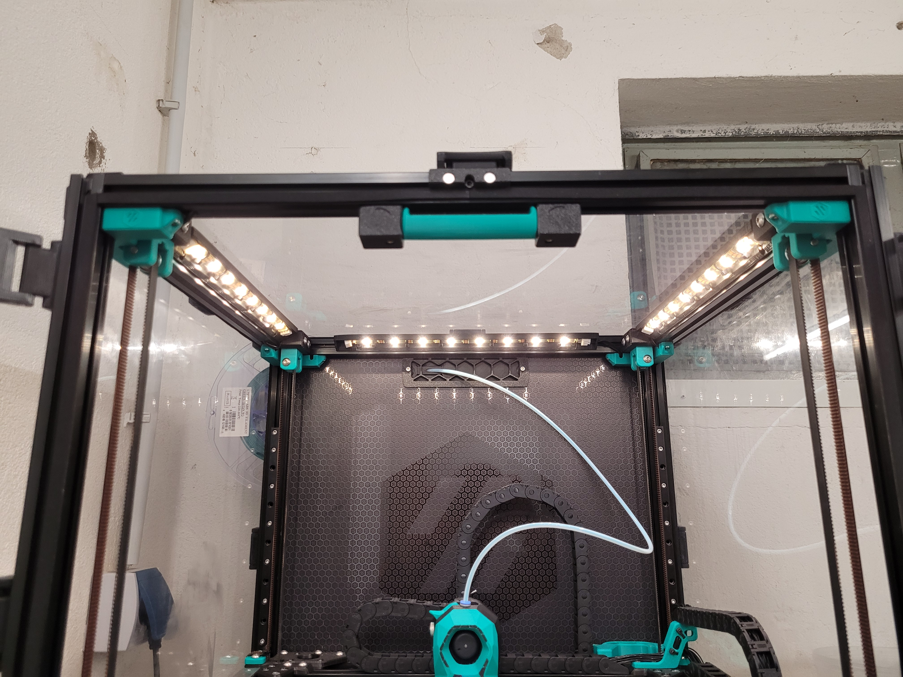

# LED Bar with zipties for installation in 2020 Extrusions

Found this on the Internet but the glue in my Hot Chamber did not hold and the LED Strips were falling off after a few weeks of use.
I just moddified this to add a few holes for small zipties to fixate the LED Strips in place.
The 310mm version is perfect for the Voron 2.4 300mm. I use these in conjunction with these corner covers in the top: https://github.com/VoronDesign/VoronUsers/tree/master/printer_mods/samwiseg0/corner_cable_hide

## Print Settings
Recommended settings are 4 perimeters/top/bottom, at least 40% infill just like the rest of the Voron Parts.

