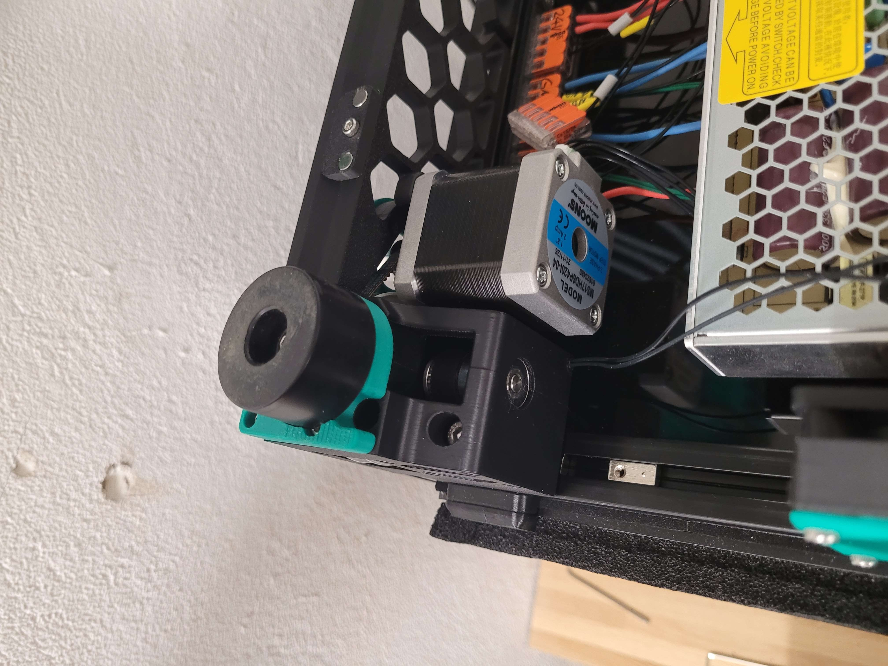

# Z Drive Frame Temperature Sensor

This is a modification to the "A" z Drive of the Voron 2.4. I included a 3mm Hole with smooth curves to route a temperature sensor from one of the Z extrusions through without the wire going out and over one of the Z Drives.

## Print Settings
Recommended settings are 4 perimeters/top/bottom, at least 40% infill just like the rest of the Voron Parts.

## Assembly

I Recommend putting the Temperature sensor wires already through during the assembly of the Z Drive instead of pushing it throught afterwards. That will make your life easier :D
